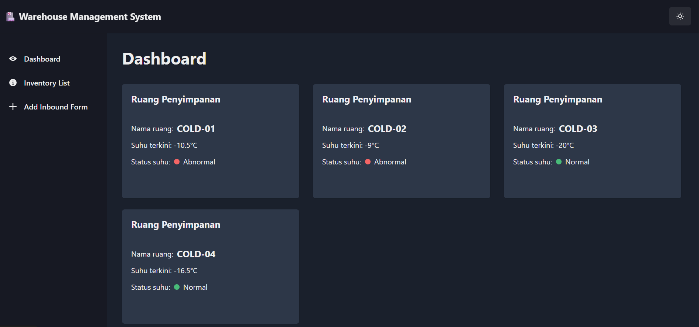
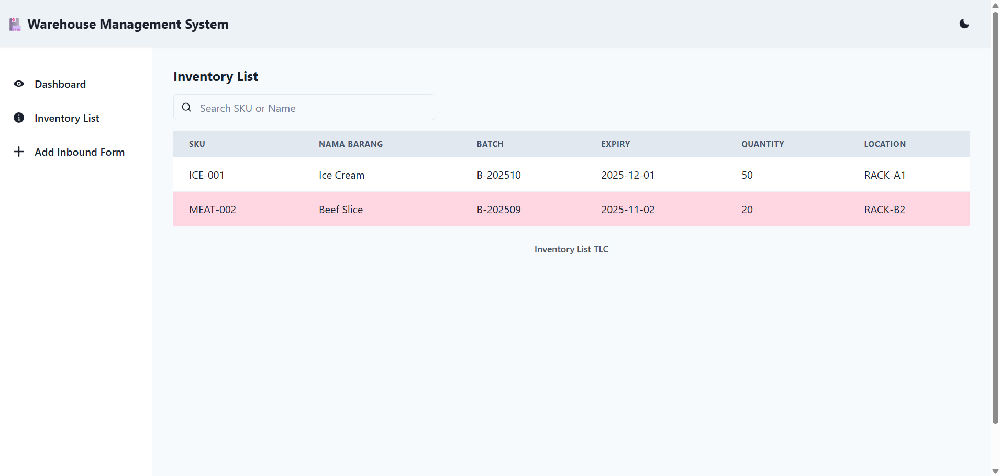

# TLC Warehouse Management System (WMS)

A simple warehouse management system built with React, TypeScript, and Vite, featuring real-time temperature monitoring, inventory management, and inbound processing capabilities.

## Screenshots

### Dashboard



### Inventory Management



## Getting Started

### Prerequisites

- Node.js (v18 or higher)
- Go (v1.19 or higher)
- npm or yarn

### Frontend Setup

1. Install dependencies:

   ```bash
   npm install
   ```

2. Start development server:

   ```bash
   npm run dev
   ```

3. Run tests:
   ```bash
   npm test
   ```

### Backend Setup

1. Navigate to backend directory:

   ```bash
   cd backend
   ```

2. Install Go dependencies:

   ```bash
   go mod download
   ```

3. Run the server:
   ```bash
   go run main.go
   ```

The application will be available at `http://localhost:5173` with the backend running on `http://localhost:8080`.

## Available Scripts

- `npm run dev` - Start development server
- `npm run build` - Build for production
- `npm run preview` - Preview production build
- `npm run lint` - Run ESLint
- `npm test` - Run tests

## Tech Stack

### Frontend

- React 19 with TypeScript
- Vite 7 for build tooling
- Chakra UI for component library
- Redux Toolkit for state management
- React Router for navigation
- React Hook Form for form handling
- Vitest for testing

### Backend

- Go (Golang)
- Standard HTTP server
- CORS support
- JSON file-based storage

## Project Structure

```
tlc-wms/
├── backend/                 # Go backend server
│   ├── data/               # JSON data storage
│   └── main.go             # Server implementation
├── src/
│   ├── components/         # React components
│   │   ├── dashboard/      # Dashboard components
│   │   ├── inbound/        # Inbound processing components
│   │   └── inventory/      # Inventory management components
│   ├── services/           # API and utility services
│   ├── types/             # TypeScript type definitions
│   ├── constant/          # Constants and static data
│   └── hooks/             # Custom React hooks
├── public/                # Static assets
└── vite.config.ts        # Vite configuration
```

## Architecture Design Decisions

1. **Frontend Architecture**

   - Component-based architecture using React for reusability and maintainability
   - Chakra UI for consistent design system and accessibility
   - Redux Toolkit for centralized state management
   - RTK Query for data fetching and caching

2. **Backend Architecture**

   - Simple Go HTTP server for reliability and performance
   - File-based storage for easy deployment and testing
   - CORS enabled for local development
   - Fallback mechanism in frontend for offline capability

3. **State Management**

   - Redux for global state
   - Local storage for offline data persistence
   - React Hook Form for form state management

4. **Type Safety**
   - TypeScript for type checking
   - Shared type definitions between components
   - Strict type checking enabled

## Development Workflow

1. Frontend development server runs on port 5173
2. Backend API server runs on port 8080
3. Frontend has fallback to local JSON data if backend is unavailable
4. ESLint and TypeScript provide development-time error checking
5. Tests can be run in watch mode during development

## Production Build

```bash
npm run build
```

This will create an optimized build in the `dist` directory.

## Testing

The project uses Vitest for testing with React Testing Library. Tests are located alongside the components they test.

To run tests:

```bash
npm test
```

## Environment Variables

Create a `.env` file in the root directory:

```env
VITE_API_URL=http://localhost:8080
```
